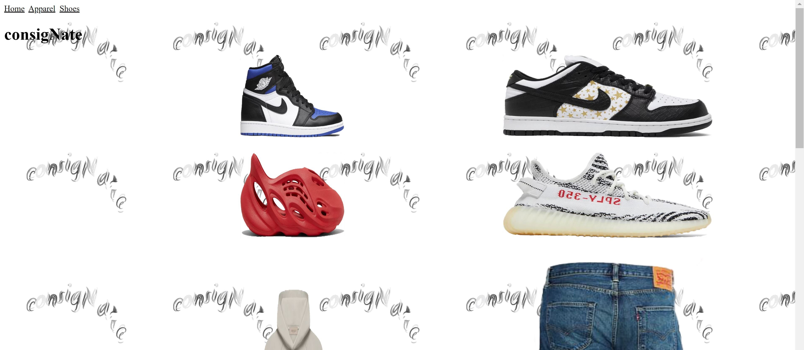
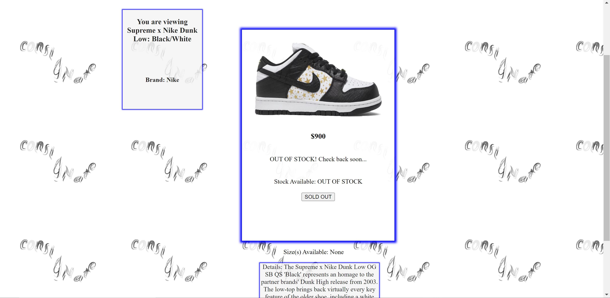
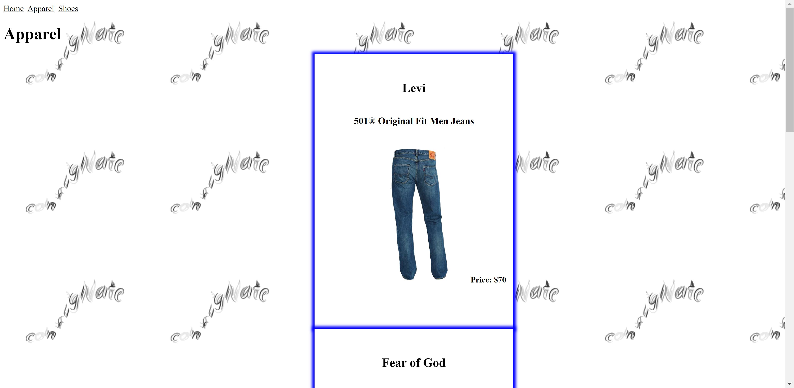
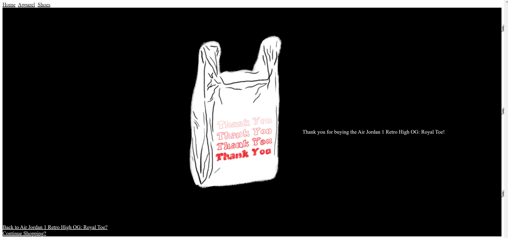

# consigNate Shop

## Description

A base website for a consignment shop used to showcase knowledge of backend and frontend technologies.

## Technologies 

- JavaScript
  - React 
  - Node.js
  - Express.js, 
- CSS
- HTML
- MongoDB

## Installation

- Fork the repo into your repository.

- Use npm install and install all of the required packages that are listed in the package.json file.
- npm run server or install and run nodemon (npm i nodemon) then type nodemon in the termainal and press Enter to start

## Restful Routes

|   VERB | PATH | DESCRIPTION
| ------------- | ------------- | ------------ |
| GET | /home | index of all products
| GET | /apparel | index of all apparel
| GET | /shoes | index of all shoes
| GET | /apparel/new | Page to add new apparel
| GET | /shoes/new | Page to add new shoe
| GET | /apparel/:id/edit | Edit an apparel
| GET | /shoes/:id/edit | Edit a shoe
| GET | /apparel/:id | Edit info about an apparel
| GET | /shoes/:id | Edit info about a shoe
| GET | /:id/confirmation | Displays the purchase/confirmation page
| GET | /apparel/seed | Deletes current apparel data from database and replaces with initial set of data 
| GET | /shoes/seed | Deletes current shoes data from database and replaces with initial set of data 
| GET | /shoes/clear | Deletes current shoes data from database
| GET | /shoes/clear | Deletes current shoes data from database
| DELETE | /apparel/:id | Delete an apparel 
| DELETE | /shoes/:id | Delete a shoe
| PUT | /apparel/:id | Update an apparel
| PUT | /shoes/:id | Update a shoe
| PUT | apparel/:id/confirmation | Buying an apparel
| PUT | shoes/:id/confirmation | Buying a pair of shoes
| POST | /apparel | Create an apparel
| POST | /shoes| Create a shoe

## Future Additions & Plans

- User authentication
- Cart handling
- Refactoring
- Resize images

## Screenshots

## Link
Check it out [consigNate](https://ncrawfordconsignate.cyclic.app/ "Not Working..")!

## License

MIT